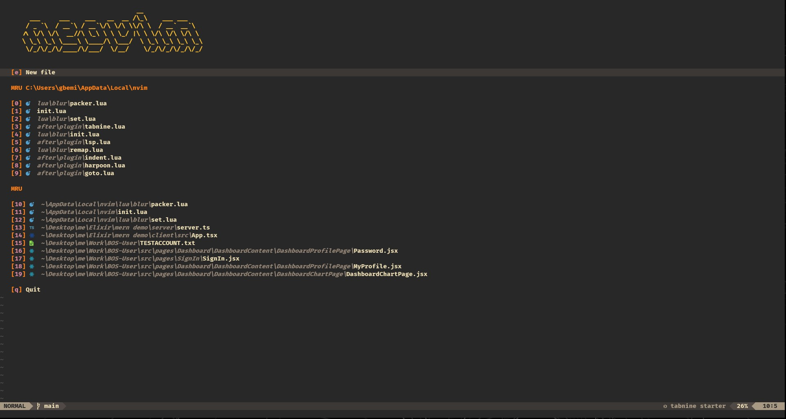

# neodots.
> my neovim configuration 

"Neodots" is the culmination of my Neovim journey, carefully crafted to suit my coding preferences and workflow. It reflects my ongoing effort to enhance productivity and create an enjoyable coding environment. Currently used on my Windows machine for university tasks, this configuration is a result of continuous refinement. I install plugins only when truly needed, acknowledging that perfection is a journey, not a destination.

## Getting Started

### Prerequisites

Before you start, make sure you have the following prerequisites on your Windows machine:

- **C Compiler:** Neovim on Windows requires a C compiler like GCC. Ensure that you have a C compiler installed on your system.
- **Neovim:** Obviously.

> to download Neovim 

### Installation

To get started with "neodots," follow these simple steps:

clone this repository

``` bash
git clone https://github.com/sijirama/neodots

```
This config uses packer as its main plugin manager so youwill need to have packer installed on your machine.

> Windows Powershell Installation

```sh
git clone https://github.com/wbthomason/packer.nvim "$env:LOCALAPPDATA\nvim-data\site\pack\packer\start\packer.nvim"

```
add the config to the file path

> On Windows NeoVim gets its configuration from %userprofile%\AppData\Local\nvim

## Screenshots

Here are some screenshots showcasing the appearance of "neodots" in action:

- Start Page:
  

- Telescope Plugin:
  

- Zen Mode:
  

- Twilight Theme:
  

## Customization

Feel free to customize "neodots" to suit your preferences. You can add or remove plugins, modify key mappings, and tweak the settings to make Neovim your own.

## Issues and Contributions

If you encounter any issues or have suggestions for improving "neodots," please open an issue on this repository. I welcome contributions and pull requests from the Neovim community to make this configuration even better.

## License

This project is licensed under the GNU General Public License v3.0. See the [LICENSE](LICENSE) file for details.

Enjoy using "neodots" and happy coding!
